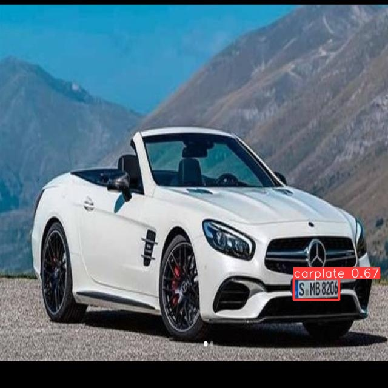
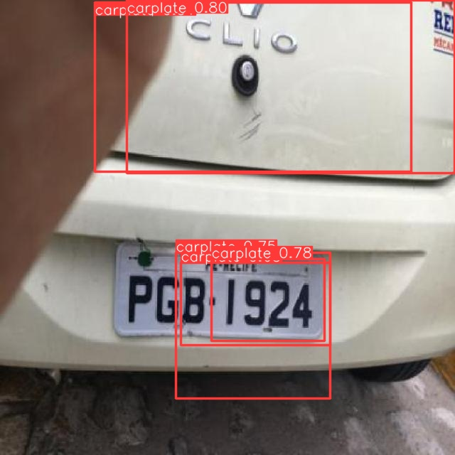
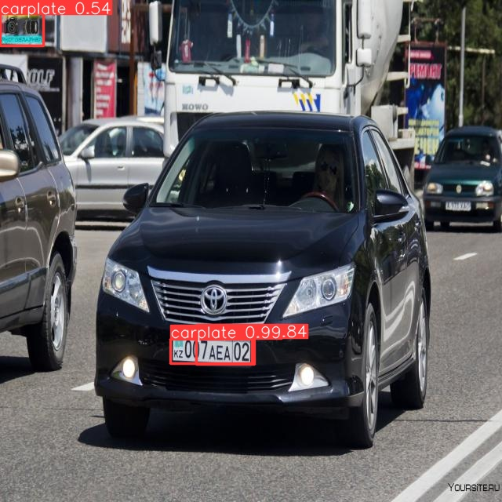
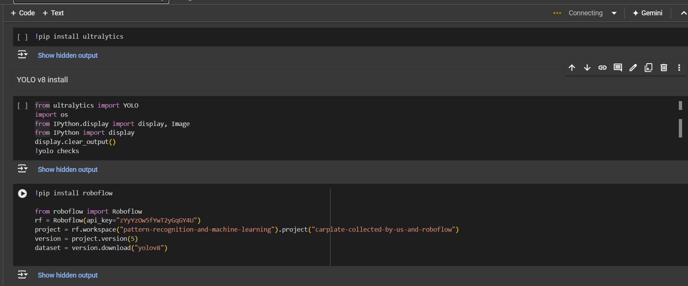
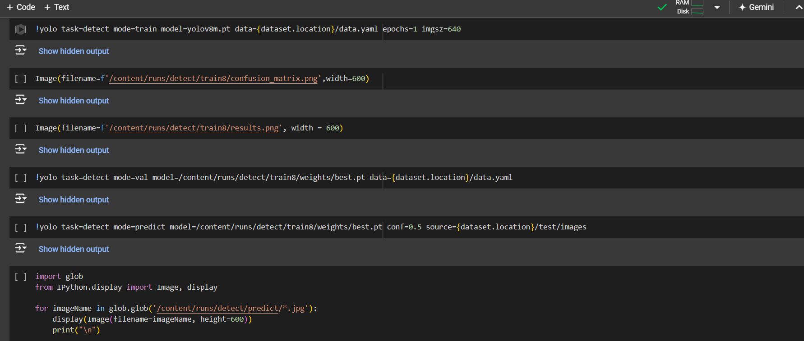

# License Plate Detection

This project implements a license plate detection system using YOLOv8 (https://docs.ultralytics.com/).

## Getting Started

This project utilizes Google Colab for training and inference.

1. Clone this repository to your Google Colab environment.

2. Run the following cells in the notebook:

   - Create a virtual environment
   - Install required libraries (`ultralytics`, `roboflow`)
   - Download the license plate dataset from Roboflow
   - Train the YOLOv8 model on the downloaded dataset
   - Evaluate the model performance
   - Run inference on test images

## Project Structure

```
.
├── README.md (this file)
└── scripts/ (folder containing the Colab notebook)
```

## Requirements

- Python 3.x
- `ultralytics` library (https://github.com/ultralytics/ultralytics)
- `roboflow` library (https://roboflow.com/)
- A Roboflow account with a license plate detection dataset

## Usage

1. Create a Roboflow account and upload your license plate dataset.
2. Obtain your Roboflow API key.
3. Replace `zYyYzOw5fYwT2yGqGY4U` in the script with your actual API key.
4. Run the Colab notebook cells sequentially.

## Results

The notebook displays the following after training:

- Confusion matrix
  
- Training results visualization
  
- Inference results on test images

- Some detection samples
   
   

   

   

## Note:

This is a basic example for educational purposes. You can further improve the model performance by:

- Training on a larger dataset
- Hyperparameter tuning
- Using transfer learning with a pre-trained model


## extra :

- google colab codes

   

   
